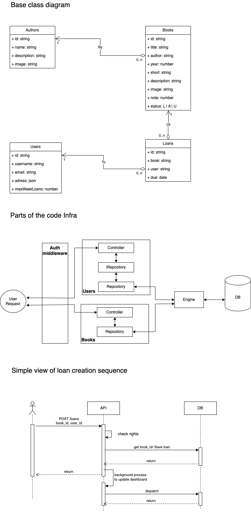

# Liboo API

A book stock management system for a library.

## Building Blocks

This application is built around several core components:

1.  **Auth (`app/auth`)**: Handles user authentication (login, registration) and token management (JWT). It uses email/password or username/password credentials.
2.  **Users (`app/users`)**: Manages user data (librarians, loaners, admins). Stores user details like username, email, address, roles, and loan limits.
3.  **Authors (`app/authors`)**: Manages author information (name, bio).
4.  **Books (`app/books`)**: Manages book details (title, description, ISBN, year, status). Each book is linked to an `Author`.
5.  **Loans (`app/loans`)**: Manages the process of borrowing books. Each loan links a `User` and a `Book`, tracking due dates and return status.
6.  **Admin Dashboard (`app/admin_dashboard`)**: Provides aggregated statistics about library activity, such as total loans, most borrowed books/authors, both overall and weekly.

**Relationships:**

*   `Users` can have multiple `Loans`.
*   `Books` can be part of multiple `Loans` (over time).
*   `Books` belong to one `Author`.
*   `Authors` can have multiple `Books`.
*   `Loans` record which `User` borrowed which `Book`.
*   `Admin Dashboard` aggregates data primarily from `Loans` and `Books`.

## Running the Application

> 5 default users (admin, librarian, loaner1, loaner2, loaner3) with the same password (chat123d). Using the *init_db.py*, just a quick way to populate the data.

### Using Docker for tests

Ensure you have Docker and Docker Compose installed.

1. **Test**
    ```bash
    docker build -t liboo . && docker run -it liboo test
    ```

### Using Docker Compose 

Ensure you have Docker and Docker Compose installed.

1.  **Navigate to the root directory** (where `docker-compose.yaml` is located):
    ```bash
    # cd to the code folder
    cd ./liboo
    ```
2.  **Build and Run:**
    ```bash
    docker-compose up --build -d
    ```
    The API will be available at `http://localhost:8000`.

### Locally with Uvicorn

Ensure you have Python 3.12+ and `uv` installed.

1.  **Install Dependencies:**
    ```bash
    uv sync
    ```
2.  **Run the Development Server:**
    ```bash
    uvicorn app.app:app --reload --port 8000 --host 0.0.0.0
    ```
    The API will be available at `http://localhost:8000`.


## Infra

The picture below depicts some basic concept the our infrastructure.
- [x] class diagram match database
- [x] illustrated **interface over implementation** in **users** routes (using repository interface)
- [x] background process on loan created, the dashboard update can be done in the background




## TODO

Some notable todos

- add logic to update most borrowed book
- add logic to update most borrowed author
- **Update error handling and messages**z
- cleanup (e.g. make sql queries only in repositories)
- add test on loans
- add coverage
- etc.